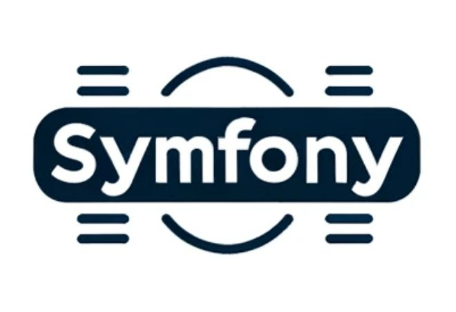

<p align="center">
  
</p>

**Skeleton** is crafted to swiftly set up the environment for new Symfony projects. 

Сontains a minimal stack for begin development: nginx, php, xdebug and minimal set symfony components for webapp type of project.

### Requirements

---
Docker compose, Git and PhpStorm as the main IDE (preferably the latest version with Shell Configuration supports).

### Versioning

---
The branch names correspond to the versions used in the set.

    php{version}_symfony{version}_lts

Example:

    php7_symfony5_lts
    php8_symfony6_lts
    php8_symfony6

### Installation

---

Decide on versions and clone the corresponding branch.
```bash
git clone -b <branch_name> https://github.com/wbrframe/docker-symfony-skeleton <project_dir>
```

After that up containers and install dependencies.

```bash
cd <project_dir>
docker composer up -d --build
docker compose exec php composer install
```